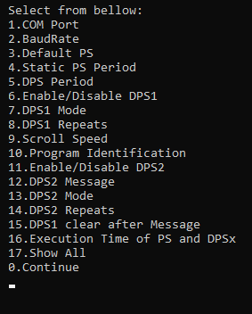
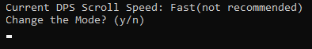
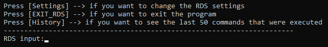

## **P232 RDS encoder module**

### **Χρήση του προγράμματος**
Αποτελεί μια διεπαφή με την οποία μπορούμε να τροφοδοτήσουμε ένα [P232 encoder](https://www.pira.cz/rds/p232man.pdf) με strings (πχ. ονόματα τραγουδιών) τα οποία τα εκπέμπει με βόηθεια κεραίας στο ραδιόφωνο με την προοπτική να εμφανιστούν στην οθόνη του (πχ: "ΤΩΡΑ ΠΑΙΖΕΙ <ΟΝΟΜΑ ΤΡΑΓΟΥΔΙΟΥ> ").

### **Λειτουργία του προγράμματος**
Συγκεκριμένα στην αρχή διαθέτει ένα menu interface στο οποίο μπορούμε να επιλέξουμε τις ρυθμίσεις της προτίμησης μας, όπως com port, scroll speed, number of repeats και άλλα. Μόλις καταχωρήσουμε τις ρυθμίσεις μεταφερόμαστε στην οθόνη που πληκτρολογούμε την είσοδο (string) που θέλουμε να εμφανιστεί στο ραδιόφωνο.

#### Menu

   
  

#### Insterting message

  

